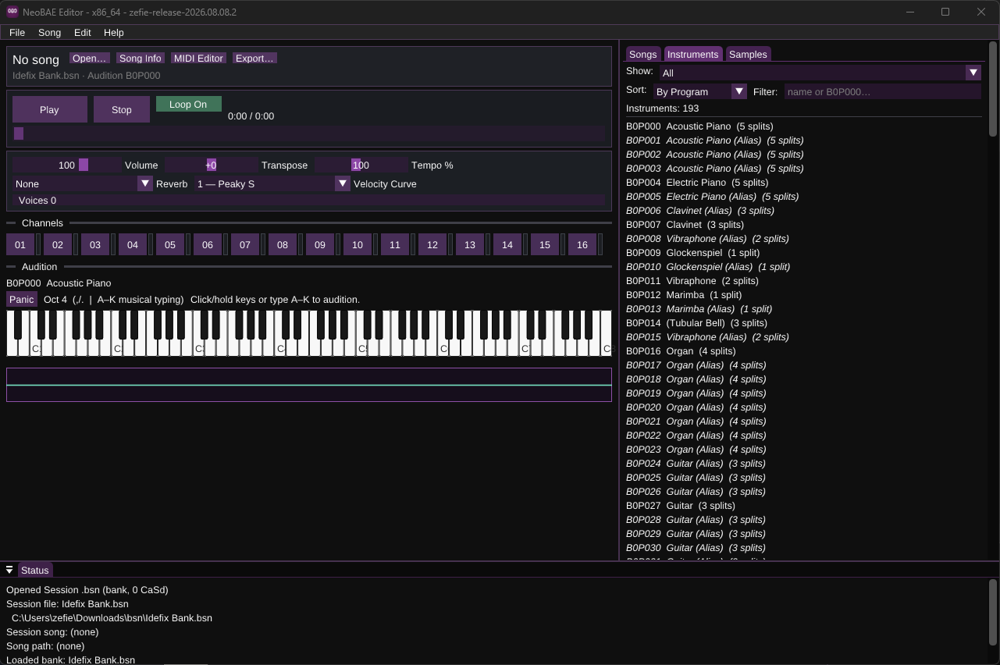
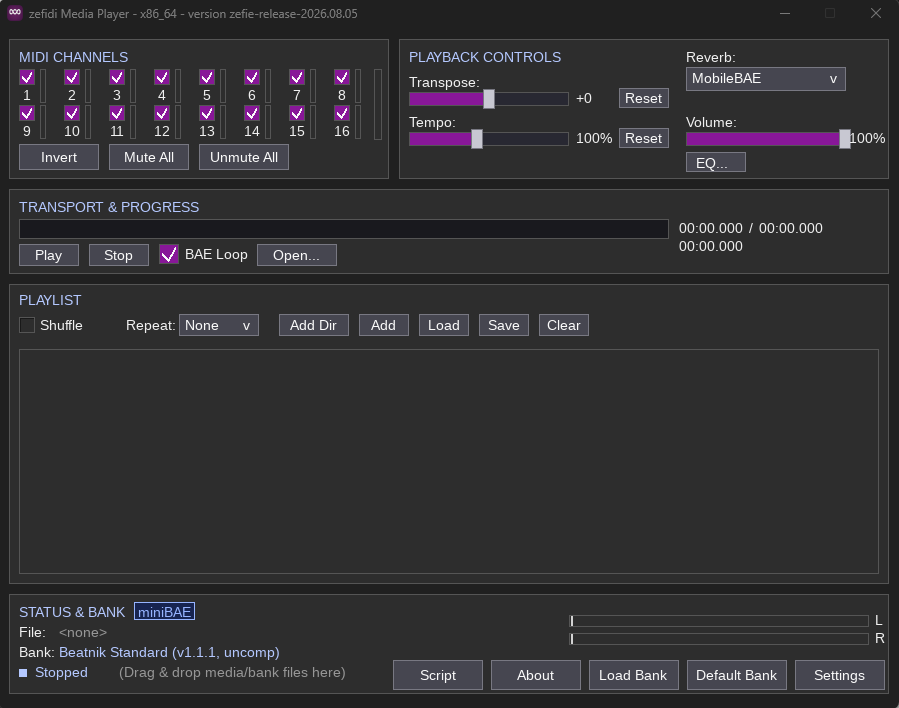

# NeoBAE

NeoBAE is a modernized continuation of [miniBAE](miniBAE_README.md) (Beatnik Audio Engine): real-time software synthesis, multi-format playback/conversion, and authoring tools, with a strong focus on retro compatibility.

Use it as an embeddable library (`libNeoBAE`), CLI player/converter (`playbae`), GUI player (`zefidi`), WebAssembly target, Android app, or RMF/ZMF authoring environment (**NeoBAE Editor**).

## Highlights

- Beatnik-style banks, General MIDI, karaoke, live MIDI, and [BAEScript](neobae/src/script/BAEScript_ReadMe.md)
- Classic Beatnik formats plus modern codecs, SoundFonts (FluidLite), and Native DLS / mobileBAE
- Linux, Windows, Android, WebAssembly, and macOS (via [Homebrew](https://brew.sh))
- Modular CMake flags to trim or enable features — see [CMakeFlags.md](CMakeFlags.md)

## NeoBAE Editor (`nbeditor`)



Dear ImGui + SDL3 editor for Beatnik-style banks and songs. **Beta / early access** — save often and keep session backups.

Projects are **Sessions** (`.bsn` / `.zsn`): songs, instruments, and samples live together, with list filters, sort, and active song remembered on save. NeoBAE Editor is backwards compatible with **Beatnik Editor 2** (open BE2 sessions; save `.bsn` for BE2 when not using ZMF-only features).

| Area | What you get |
|------|----------------|
| Open / Import | Sessions, RMF/ZMF, MIDI, WAV/AIFF, tracker modules (MOD/S3M/XM/IT/… via `mod2rmf`); drag-and-drop |
| Instruments & samples | Instrument Editor (key splits, ADSR, flags); Sample Editor (trim, loop, gain, compress) |
| Songs | Piano-roll MIDI Editor; karaoke lyrics with tap-to-sync (optional hyphenation for syllables) |
| Banks | Built-in Beatnik Standard bank for playback; Bank 2+ as the custom-instrument sandbox |
| Export | RMF or ZMF (ZMF when NeoBAE extensions are needed); bank export; render to audio |
| Extra | Soft-delete Trash; multi-instance copy/paste; hardware MIDI input when built with RtMidi |

```bash
cmake -B build -DBUILD_NBEDITOR=ON .
cmake --build build --parallel $(nproc) --target nbeditor
./build/bin/nbeditor
```

## playbae, zefidi, and mobileBAE



**playbae** is the CLI player, offline renderer, and exporter. **zefidi** is the classic SDL GUI player (playlists, channel panel, karaoke, export, BAEScript editor, hardware MIDI).

With **Native DLS** enabled, both playbae and zefidi play **mobileBAE** content authentically:

- **XMF / MXMF** (`.xmf`, `.mxmf`) with embedded or companion DLS
- Standalone **DLS** banks, including MobileBAE `pgal` banks
- MobileBAE quirks and reverb (type 17) by default for historical behavior
- playbae: `-dlscompat` broadens generic DLS support (turns quirks off — not for authentic MobileBAE)
- zefidi: **Smart DLS Handling** toggles the same quirk mode; bank badges identify mobileBAE / microQ / HSB / ZSB / SF2 sources

**microQ** (QSound “scrambled eggs” DLS) is recognized and handled on the same Native DLS path — a small but important niche for phone ROMs and TouchWiz-era banks.

```bash
./build/bin/playbae -nf -t 10 -p bank.dls -f song.mxmf -o /tmp/out.wav
./build/bin/playbae -h
```

## Supported formats

**Songs / containers:** MIDI/KAR, RMI (embedded DLS/SF2 when built in), RMF, ZMF, XMF/MXMF, Nokia MTHC; MOD import via `mod2rmf` ([libxmp](https://github.com/libxmp/libxmp))

**Ringtones:** iMelody, Nokia `.rng`, RTTTL/RTX

**Audio:** WAV/AIFF/AU, MP2/MP3, FLAC, Vorbis, Opus, QOA, WMA, ADP, CRI ADX

**Banks:** HSB/ZSB; SF2/SF3/SFO (FluidLite); DLS (Native DLS)

## Other applications & tools

- `libNeoBAE` — embeddable engine library
- Android: `neobae/src/NeoBAEDroid`
- WebAssembly: `make -f Makefile.emcc` from `neobae/`
- CLI: `songtool`, `rmfutil`, `rmiutil`, `xmfutil`, `mod2rmf`, `ringtone2mid`, `sf2-hsb`, `bankrecomp`, `adp2wav`, `adx2wav`, `mthc_decomp`, and related utilities

## Quick start

CMake from the repository root (initialize submodules first):

```bash
cmake -B build .
cmake --build build --parallel $(nproc)
./build/bin/playbae -h
```

Platform prerequisites, Windows builds, legacy Makefiles, and feature flags: [HowToBuild.md](HowToBuild.md), [CMakeFlags.md](CMakeFlags.md).

## Layout & docs

- `neobae/` — engine, frontends, CLI tools, banks, examples (`src/BAE_Source/`, `src/NeoBAEDroid/`, …)
- `content/` — sample media
- [miniBAE_README.md](miniBAE_README.md) · [BAEScript](neobae/src/script/BAEScript_ReadMe.md) · [ACKNOWLEDGEMENTS](neobae/ACKNOWLEDGEMENTS)

## License

NeoBAE modifications: **LGPL-3.0**. Original Beatnik miniBAE: **BSD-3-Clause**. See [LICENSE](LICENSE), [LICENSE.BSD](LICENSE.BSD), and [NOTICE](NOTICE).

Native DLS support includes code ported from [RetroDLS](https://github.com/Magstic/RetroDLS) (MIT), copyright (c) 2026 Magstic.
