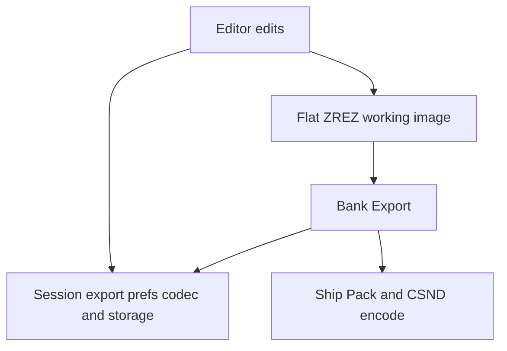

# Beatnik Editor 2 resource model vs NeoBAE

Light reverse-engineering of `Beatnik Editor 2.exe` (2001,
`/mnt/d/bin/BXPlayer/Editor/`) compared to NeoBAE’s editor bank policy.
Goal: bank/resource mutation semantics only — not UI reimplementation.

---

## Phase 2 gate: uncompressed Z\* blocks — **not implemented**

| Question | Finding |
|----------|---------|
| Does the editor need plain (non-LZMA) ZINS/ZSNG/ZBNK? | **No**, for now |
| Why | Flat INST/ALIAS/SND in a ZREZ map is valid; UnloadBank omit already emits flat INST; Purge/Finalize never re-LZMA |
| When to revisit | Session `.zsn` size or omit/walk cost on huge banks becomes a measured regression |

Ship banks may still contain packed Z\*; NeoBAE keeps them opaque and shadows with flat peers.

---

## BE2 strings / architecture (Phase 3)

### Working container

- Map type **`IREZ`** only (no ZREZ / ZINS / LZMA bank packing in the binary).
- Resources are classic flat INST / SND / ALIAS / SONG / MIDI.

### Sample compression (authoring choice)

| BE2 | NeoBAE |
|-----|--------|
| `CompressionDialog` / `CompressionManager` | Sample editor compression modal |
| “Compress Sample(s)”, audition compressed vs original | `PreviewCompressPCM` (RAM audition) |
| “Saving compressed samples…” on save/export | Bank Export `ApplySessionExportTargetsToBank` |
| “Clear compression cache” / “Delete uncompressed originals” | CaSd / session PCM cache UI |
| Import expands to uncompressed | Session PCM / CaSd masters |

### Instrument edits

| BE2 symbol | Likely role | NeoBAE analogue |
|------------|-------------|-----------------|
| `InstrSimpleEditCmd` | Small INST field edits | Keymap Vol/Low/High → `XReplaceFileResource` / `PV_BankReplaceInstResourceInPlace` |
| `InstrLargeEditCmd` | Larger INST rewrites (splits grow/delete) | Grow/Delete/Clone → `PV_BankCommitResource` |
| `BAEFileResource` | Engine-facing loaded resource | Mixer bank token + `EnsureWritable` |
| `SetResource with non-zero load count` | Refuse replace while engine holds a live load | NeoBAE: unload / LivePatch / EnsureWritable before mutate |

BE2’s load-count guard is the closest match to NeoBAE needing `EnsureActiveBankWritable()` before INST XReplace (read-only file tokens cannot append shadows).

### Live preview

BE2 instrument panels (`InstrKeymap`, `InstrVolume`, …) patch the running engine; NeoBAE uses `BAESong_PatchLoadedInstrumentExtInfo` + LivePatch against the same mixer bank image (no second preview bank).

---

## NeoBAE mapping (current policy)

1. **Interactive:** flat resources + FinalizeEditor (no Pack LZMA).
2. **Sample Apply:** PCM `SND` in bank; codec/storage remembered on `SessionPcmCacheEntry`.
3. **Export:** encode pending samples, then pack for ship.
4. **BE2 lesson:** compression and packing are deliberate save/export steps, not per-keystroke bank rewrites.

---

## Further RE (optional)

If LivePatch / dirty tracking still diverges from BE2 feel:

1. Disassemble `BAEFileResource::SetResource` around the “non-zero load count” string.
2. Trace `InstrSimpleEditCmd` vs `InstrLargeEditCmd` write size.
3. Compare whether BE2 keeps an in-memory INST copy separate from the IREZ image until Save.

Not required for the current flat-ZREZ + deferred-CSND policy.
